# RotorLab Complete Beginner's Study Guide

## Read This First

This document explains the project from zero. It assumes that you can understand
basic programming but have never studied motors, control systems, or signal
processing.

Do not try to memorize every sentence. First understand the story:

> We have a motor. We want it to rotate at a chosen speed. A speed sensor tells
> us how fast it is rotating, but the sensor reading contains noise. An FIR
> filter cleans the reading. A PID controller compares the cleaned speed with
> the desired speed and tells the drive whether to push the motor harder or
> reduce its effort. The web application displays the whole process.

That is the entire project in one paragraph.

---

# Part 1: The Big Picture

## 1. What Did We Build?

RotorLab is a **software simulation** of an induction motor control system.

It is not connected to a physical motor. Instead, JavaScript performs
calculations that behave approximately like a motor:

- The simulated motor starts from zero.
- It accelerates toward a target speed.
- A load makes it harder to rotate.
- A speed sensor reports its speed.
- Noise makes the sensor reading imperfect.
- An FIR filter smooths the noisy reading.
- A PID controller tries to keep the speed near the target.
- The dashboard displays everything in real time.

## 2. The Main Control Loop

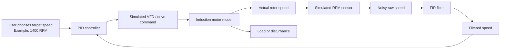

The arrow from the filtered speed back to the PID controller is called
**feedback**.

Without feedback, the system would send power to the motor without checking
what actually happened.

With feedback, the system repeatedly asks:

1. What speed do we want?
2. What speed do we currently have?
3. What is the difference?
4. How should we change the drive command?

This cycle runs every `0.2 seconds`, or five times per second.

## 3. Programming Analogy

Think of the system as a loop:

```js
while (motorIsRunning) {
  error = targetSpeed - measuredSpeed;
  driveCommand = pidController(error);
  actualSpeed = motorPhysics(driveCommand, load);
  rawSensorSpeed = actualSpeed + noise;
  measuredSpeed = firFilter(rawSensorSpeed);
}
```

The actual implementation is more detailed, but this is its basic structure.

---

# Part 2: AC and Induction Motor Basics

## 4. What Is a Motor?

A motor converts **electrical energy** into **mechanical motion**.

Electrical energy enters the motor through wires. The motor produces a rotating
shaft. That shaft can turn:

- A pump
- A fan
- A conveyor belt
- A compressor
- An elevator mechanism
- A machine tool

## 5. What Does AC Mean?

AC means **alternating current**.

In direct current, or DC, electric current mainly flows in one direction. In
alternating current, the direction changes repeatedly.

The Nigerian electrical supply is normally around `50 Hz`. This means that the
AC waveform completes 50 cycles every second.

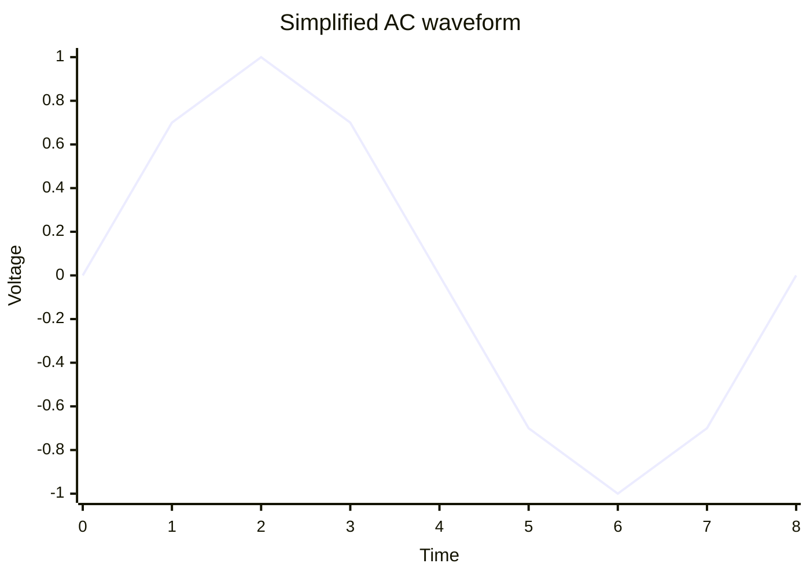

The waveform above is simplified. Real AC voltage follows a sine wave.

## 6. Single-Phase and Three-Phase AC

Homes commonly use single-phase power. Industrial motors commonly use
**three-phase AC**.

Three-phase power has three AC waveforms separated in time. Together, they
naturally create a rotating magnetic field.

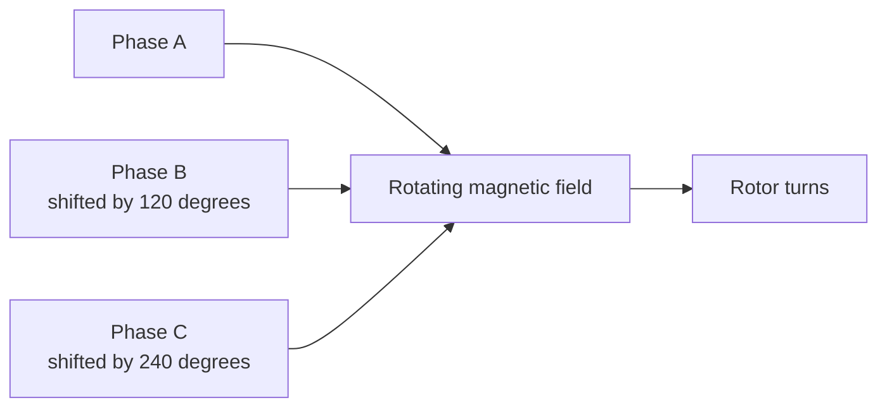

You do not need to derive three-phase mathematics for this project. The
important point is:

> Three-phase AC creates a smooth rotating magnetic field, which makes it
> suitable for industrial motors.

## 7. What Is an Induction Motor?

An induction motor is an AC motor in which current is **induced** in the rotor.

Its two major parts are:

- **Stator:** The stationary outside part containing electrical windings.
- **Rotor:** The inside part that rotates and drives the shaft.

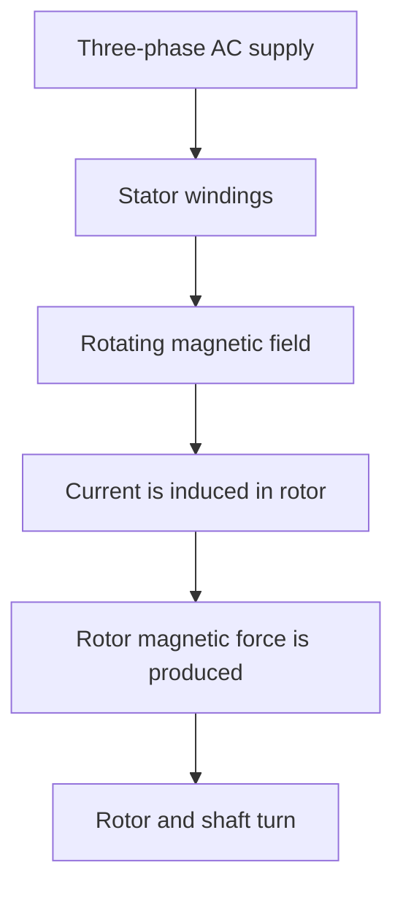

The stator does not physically touch the rotor to pull it. The interaction is
electromagnetic.

## 8. Why Is It Called an Induction Motor?

The rotor is not normally connected directly to the AC supply. The stator's
rotating magnetic field causes, or **induces**, current in the rotor.

This follows the general idea of electromagnetic induction:

> A changing magnetic field can produce electric current in a nearby conductor.

The induced rotor current creates its own magnetic effect. The interaction
between the stator field and rotor field creates torque.

## 9. What Is Torque?

Torque is a **turning force**.

Force pushes something in a straight line. Torque turns something around an
axis.

Examples:

- Pushing a door near its handle creates torque around the hinges.
- A wrench creates torque on a bolt.
- A motor creates torque on its shaft.

Torque is commonly measured in **newton-metres**, written `Nm`.

Our default motor has a rated torque of `14.6 Nm`.

## 10. What Is Load Torque?

The **load** is whatever the motor is trying to turn.

Examples:

- Water in a pump
- Boxes on a conveyor
- Air moved by a fan
- An elevator cabin

Load torque is the turning resistance produced by that load.

If load torque increases:

- The motor has more work to do.
- Acceleration decreases.
- Speed may fall temporarily.
- The controller must apply a stronger drive command.

Programming analogy:

```text
Motor torque is like CPU capacity.
Load torque is like computational workload.
More workload means the system needs more effort to maintain performance.
```

## 11. What Is Inertia?

Inertia is resistance to a change in motion.

A heavy flywheel does not start or stop instantly. It has high inertia.

A motor with greater rotor and load inertia:

- Accelerates more slowly.
- Decelerates more slowly.
- May respond more smoothly.
- Requires more torque to change speed quickly.

Our model stores inertia as `inertiaKgM2`.

## 12. Important Motor Parameters

The default motor is defined in `server/data/motors.json`.

| Parameter | Default | Meaning |
|---|---:|---|
| Rated power | 2.2 kW | Approximate intended mechanical output capability |
| Rated voltage | 415 V | Designed three-phase supply voltage |
| Frequency | 50 Hz | Supply cycles per second |
| Poles | 4 | Magnetic pole count that affects synchronous speed |
| Rated speed | 1440 RPM | Normal full-load operating speed |
| Rated torque | 14.6 Nm | Normal shaft turning force |
| Stator resistance | 3.2 ohms | Electrical resistance of stator windings |
| Rotor resistance | 2.1 ohms | Effective rotor electrical resistance |
| Inertia | 0.018 kg m² | Resistance to acceleration/deceleration |

### Rated Does Not Mean Maximum

**Rated** means the value at which the manufacturer expects the equipment to
operate normally and safely.

A motor may briefly exceed a rated value, but continuous operation above its
rating can cause heat, damage, or reduced life.

## 13. Power in kW

`kW` means kilowatts.

```text
1 kW = 1000 watts
2.2 kW = 2200 watts
```

Mechanical power is related to torque and angular speed:

```text
Power = Torque x Angular speed
```

For rotation:

```text
P = T x omega
```

where:

- `P` is power in watts.
- `T` is torque in newton-metres.
- `omega` is angular speed in radians per second.

To convert RPM to radians per second:

```text
omega = 2 x pi x RPM / 60
```

For the default motor:

```text
omega = 2 x pi x 1440 / 60
      = approximately 150.8 rad/s

Power = 14.6 x 150.8
      = approximately 2202 W
      = approximately 2.2 kW
```

This shows that the listed torque, speed, and power are consistent.

---

# Part 3: Speed, Frequency, Poles, and Slip

## 14. What Is RPM?

RPM means **revolutions per minute**.

One revolution is one complete rotation.

If a shaft rotates 1400 times in one minute, its speed is `1400 RPM`.

```text
1400 RPM / 60 = approximately 23.33 revolutions per second
```

## 15. What Are Motor Poles?

Poles are magnetic north-south regions created by the stator windings.

The number of poles changes the speed of the rotating magnetic field.

At the same frequency:

- Fewer poles produce a faster field.
- More poles produce a slower field.

Typical values are 2, 4, 6, and 8 poles.

## 16. Synchronous Speed

Synchronous speed is the speed of the stator's rotating magnetic field.

The formula is:

```text
Ns = 120f / P
```

where:

- `Ns` = synchronous speed in RPM
- `f` = supply frequency in hertz
- `P` = number of poles

### Worked Example: Default Motor

The default motor has:

```text
f = 50 Hz
P = 4 poles
```

Therefore:

```text
Ns = 120 x 50 / 4
Ns = 6000 / 4
Ns = 1500 RPM
```

### Comparison

| Frequency | Poles | Synchronous speed |
|---:|---:|---:|
| 50 Hz | 2 | 3000 RPM |
| 50 Hz | 4 | 1500 RPM |
| 50 Hz | 6 | 1000 RPM |
| 50 Hz | 8 | 750 RPM |

This is why frequency and pole count matter.

## 17. Why Does the Rotor Not Reach Synchronous Speed?

An induction motor needs relative motion between:

- The rotating stator magnetic field
- The physical rotor

That relative speed allows current to be induced in the rotor.

If the rotor reached exactly the same speed as the magnetic field:

- Relative motion would become zero.
- Induced rotor current would greatly reduce.
- Electromagnetic torque would reduce.
- The rotor would slow down again.

Therefore, a normal induction motor rotor runs slightly below synchronous speed.

## 18. Slip

Slip is the difference between synchronous speed and rotor speed, expressed as
a percentage of synchronous speed.

```text
Slip = ((Ns - Nr) / Ns) x 100%
```

where:

- `Ns` = synchronous speed
- `Nr` = actual rotor speed

### Worked Example at Rated Speed

```text
Ns = 1500 RPM
Nr = 1440 RPM

Slip = ((1500 - 1440) / 1500) x 100
Slip = (60 / 1500) x 100
Slip = 4%
```

### Worked Example at Our 1400 RPM Target

```text
Ns = 1500 RPM
Nr = 1400 RPM

Slip = ((1500 - 1400) / 1500) x 100
Slip = 6.67%
```

### Slip at Startup

At startup:

```text
Nr = 0 RPM

Slip = ((1500 - 0) / 1500) x 100
Slip = 100%
```

As the rotor accelerates, slip decreases.

## 19. Code for Synchronous Speed and Slip

In `server/motor-simulation.js`:

```js
get synchronousSpeed() {
  return (120 * this.motor.frequency) / this.motor.poles;
}
```

This directly implements:

```text
Ns = 120f / P
```

Slip is calculated with:

```js
const slip = this.synchronousSpeed
  ? ((this.synchronousSpeed - this.actualRpm) / this.synchronousSpeed) * 100
  : 0;
```

The conditional avoids division by zero.

---

# Part 4: How Motor Speed Is Controlled

## 20. What Is a VFD?

VFD means **Variable Frequency Drive**.

A VFD is an electronic device placed between the electrical supply and an AC
motor. It controls the frequency and voltage delivered to the motor.

Because synchronous speed depends on frequency:

```text
Ns = 120f / P
```

changing frequency changes motor speed.

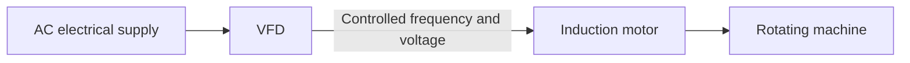

For example, with four poles:

```text
At 50 Hz: Ns = 1500 RPM
At 40 Hz: Ns = 1200 RPM
At 30 Hz: Ns = 900 RPM
```

## 21. Does Our Project Model a Real VFD?

Not electrically.

Our project uses a simplified `driveCommand` between approximately 0 and 1:

```js
const driveCommand = clamp(pid / 900, -0.3, 1);
const targetFromDrive = driveCommand * this.synchronousSpeed;
```

Interpretation:

- `0` means little or no driving effort.
- `0.5` means roughly half of the available simulated speed command.
- `1` means the maximum normal simulated command.

We describe this as **VFD-style control** because the controller changes the
effective motor drive. We do not simulate:

- AC waveform switching
- Pulse-width modulation
- Voltage-to-frequency ratio
- Stator current equations
- Rotor flux
- dq-axis electromagnetic equations

This is acceptable for an educational web demonstration, but be honest about
it during defense.

## 22. Open-Loop Versus Closed-Loop Control

### Open-Loop

An open-loop system sends a command but does not measure the result.


If the load changes, the system may not correct the speed.

### Closed-Loop

A closed-loop system measures the result and feeds it back.

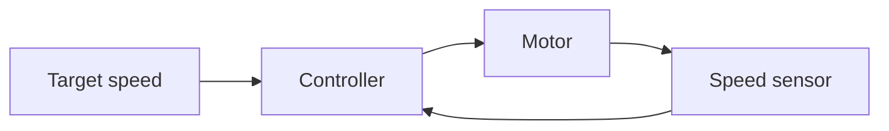

RotorLab is a closed-loop system.

## 23. Setpoint, Process Variable, and Error

Control-system vocabulary:

- **Setpoint:** The desired value. In our app, target RPM.
- **Process variable:** The measured value. In our app, filtered RPM.
- **Error:** Setpoint minus measured value.

```text
Error = Target speed - Measured speed
```

Example:

```text
Target = 1400 RPM
Measured = 1100 RPM
Error = 1400 - 1100 = 300 RPM
```

The positive error tells the controller that the motor is too slow.

If:

```text
Target = 1400 RPM
Measured = 1420 RPM
Error = 1400 - 1420 = -20 RPM
```

The negative error tells the controller that the motor is too fast.

---

# Part 5: PID Control

## 24. What Does PID Mean?

PID means:

- **P:** Proportional
- **I:** Integral
- **D:** Derivative

A PID controller combines three ways of reacting to error.

```text
Output = Proportional + Integral + Derivative
```

The mathematical form is:

```text
u(t) = Kp e(t) + Ki integral(e(t)) + Kd de(t)/dt
```

Do not panic about the symbols. The code calculates each part using ordinary
variables.

## 25. Human Driving Analogy

Imagine that you are driving and want to maintain `60 km/h`.

### Proportional

You look at the current speed difference:

- At 20 km/h, press the accelerator strongly.
- At 55 km/h, press it lightly.
- At 60 km/h, little correction is needed.

### Integral

Suppose you are climbing a hill and remain stuck at 57 km/h. The error is small
but continues for several seconds. You gradually press harder because the error
has persisted.

### Derivative

Suppose speed is increasing very rapidly toward 60 km/h. Even before reaching
60, you begin easing off to avoid overshooting.

Together, these actions resemble PID control.

## 26. The Proportional Term

```text
P = Kp x current error
```

Conceptually:

```js
const error = targetRpm - feedbackRpm;
const proportional = this.config.kp * error;
```

The project combines it directly inside:

```js
const pid =
  this.config.kp * error +
  this.config.ki * this.integral +
  this.config.kd * derivative;
```

### Effect of Kp

- Low `Kp`: Slow, weak response.
- Higher `Kp`: Faster correction.
- Excessive `Kp`: Overshoot or oscillation may increase.

Default:

```text
Kp = 0.72
```

## 27. The Integral Term

Integral means accumulated error over time.

In discrete software:

```js
this.integral = this.integral + error * dt;
```

If the motor stays 20 RPM too slow for many updates, all those small errors add
up. The integral term applies extra effort until the remaining offset is
removed.

```text
I = Ki x accumulated error
```

### Effect of Ki

- `Ki = 0`: A permanent small speed error may remain.
- Moderate `Ki`: Removes steady-state error.
- Excessive `Ki`: Can cause overshoot and slow oscillation.

Default:

```text
Ki = 0.18
```

## 28. The Derivative Term

Derivative means rate of change.

The code estimates how quickly error changes:

```js
const derivative = (error - this.previousError) / dt;
```

If error falls very quickly, the motor may be approaching the target at high
speed. Derivative action can reduce the command before overshoot becomes large.

```text
D = Kd x rate of error change
```

### Effect of Kd

- `Kd = 0`: No derivative damping.
- Moderate `Kd`: May reduce overshoot and fast oscillation.
- Excessive `Kd`: Can make the controller sensitive to noise.

Default:

```text
Kd = 0.06
```

## 29. A Small Numerical PID Example

Suppose:

```text
Target speed = 1400 RPM
Actual speed = 1300 RPM
Error = 100 RPM

Kp = 0.72
Ki = 0.18
Kd = 0.06

Accumulated error = 500
Rate of error change = -50 RPM/s
```

Then:

```text
P = 0.72 x 100 = 72
I = 0.18 x 500 = 90
D = 0.06 x -50 = -3

PID output = 72 + 90 - 3
PID output = 159
```

The negative derivative term reduces the output because the error is already
falling.

This is an illustrative example. The values in the running simulation change
every 0.2 seconds.

## 30. What Is PID Tuning?

PID tuning means choosing suitable values for `Kp`, `Ki`, and `Kd`.

There is no universal perfect set of gains. Good values depend on:

- Motor size
- Load
- Inertia
- Sensor noise
- Required response speed
- Acceptable overshoot

### Simple Manual Tuning Idea

1. Start with `Ki = 0` and `Kd = 0`.
2. Increase `Kp` until the response becomes fast but not wildly oscillatory.
3. Add a small `Ki` to remove remaining steady-state error.
4. Add a small `Kd` if overshoot or rapid oscillation needs damping.
5. Test again after a load disturbance.

Our defaults are preselected for a reasonable visual demonstration.

## 31. PI, PID, FIR, and PIR Are Different

| Term | Full meaning | Role |
|---|---|---|
| PI | Proportional-Integral controller | Speed control without derivative |
| PID | Proportional-Integral-Derivative controller | Speed control with all three terms |
| FIR | Finite Impulse Response filter | Cleans sensor noise |
| PIR | Passive Infrared sensor | Detects warm moving objects; unrelated here |

If your lecturer says **PIR**, ask whether they meant **PI** or **PID**. A PIR
motion sensor is normally used for detecting people, not controlling induction
motor speed.

## 32. Integral Windup

Imagine the motor is stopped but the target remains 1400 RPM. The error is very
large. If the integral accumulates forever, it may become enormous.

When the motor starts, the stored integral could continue commanding excessive
effort and cause large overshoot.

This is called **integral windup**.

The project limits the accumulated value:

```js
this.integral = clamp(
  this.integral + error * dt,
  -8500,
  8500
);
```

This is a simple anti-windup method.

## 33. Why Use `clamp`?

`clamp(value, min, max)` forces a value to stay inside a safe range.

```js
function clamp(value, min, max) {
  return Math.min(max, Math.max(min, value));
}
```

Examples:

```text
clamp(5, 0, 10) = 5
clamp(-3, 0, 10) = 0
clamp(20, 0, 10) = 10
```

The project uses it to limit:

- Target RPM
- Load torque
- PID gains
- Integral accumulation
- Drive command
- Actual speed
- FIR tap count

---

# Part 6: Sensors and Noise

## 34. How Is Motor Speed Measured Physically?

A real system needs a speed sensor. Common options include:

### Encoder

An encoder produces electrical pulses as the shaft rotates.

If an encoder produces 100 pulses per revolution and the system counts 2333
pulses in one second:

```text
Revolutions per second = 2333 / 100 = 23.33
RPM = 23.33 x 60 = approximately 1400 RPM
```

### Hall-Effect Sensor

A magnet is attached to the shaft. A Hall sensor detects each time the magnet
passes.

### Optical Sensor

A reflective mark or slotted disk interrupts light. The pulse frequency
indicates speed.

### Tachogenerator

A small generator produces voltage approximately proportional to shaft speed.

## 35. What Does Our Project Use?

It simulates a generic RPM sensor.

The true internal simulation value is:

```js
this.actualRpm
```

The simulated sensor reading is:

```js
this.rawRpm = this.actualRpm + sensorNoise;
```

Therefore:

- `actualRpm` is the hidden ideal physical speed.
- `rawRpm` is what an imperfect sensor appears to report.
- `filteredRpm` is the cleaned measurement shown to the controller/operator.

## 36. What Is Noise?

Noise is unwanted variation in a signal.

Suppose the actual speed is exactly 1400 RPM. A real sensor might report:

```text
1392, 1411, 1398, 1407, 1389, 1404, 1399
```

The motor did not necessarily make all those exact speed changes. Some
variation came from measurement noise.

Possible physical causes include:

- Electromagnetic interference from motor cables
- VFD switching
- Mechanical vibration
- Loose sensor mounting
- Electrical grounding problems
- Pulse-counting resolution
- Analogue-to-digital conversion error

## 37. How the Project Creates Noise

```js
const sensorNoise =
  (Math.random() - 0.5) * 38 +
  Math.sin(this.elapsedSeconds * 13) * 8;
```

This has two parts.

### Random Noise

```js
(Math.random() - 0.5) * 38
```

`Math.random()` returns a number from 0 to nearly 1.

After subtracting `0.5`, the range is approximately:

```text
-0.5 to +0.5
```

After multiplying by 38:

```text
-19 RPM to +19 RPM
```

### Periodic Noise

```js
Math.sin(this.elapsedSeconds * 13) * 8
```

This adds a repeating sine-wave disturbance of approximately:

```text
-8 RPM to +8 RPM
```

Together they make the raw line visibly rough.

---

# Part 7: FIR Filtering

## 38. What Is a Filter?

A filter processes a signal to reduce unwanted parts or emphasize useful parts.

Examples outside engineering:

- A coffee filter keeps grounds out of the drink.
- A spam filter removes unwanted email.
- A photo filter changes image information.
- A signal filter reduces unwanted electrical variation.

Our FIR filter reduces rapid speed measurement changes.

## 39. What Does FIR Mean?

FIR means **Finite Impulse Response**.

For this project, the easiest way to understand it is:

> An FIR filter calculates a new output using a fixed, finite number of recent
> input samples.

It does not require an infinite history.

## 40. The Moving-Average FIR Filter

RotorLab uses a moving average.

With seven taps:

```text
filtered value =
  (current sample
  + previous sample 1
  + previous sample 2
  + previous sample 3
  + previous sample 4
  + previous sample 5
  + previous sample 6) / 7
```

General FIR formula:

```text
y[n] = b0x[n] + b1x[n-1] + ... + bMx[n-M]
```

For a seven-tap equal moving average:

```text
b0 = b1 = b2 = b3 = b4 = b5 = b6 = 1/7
```

## 41. What Is a Tap?

A tap is one delayed sample and its coefficient.

For a seven-tap filter, seven recent measurements contribute to each output.

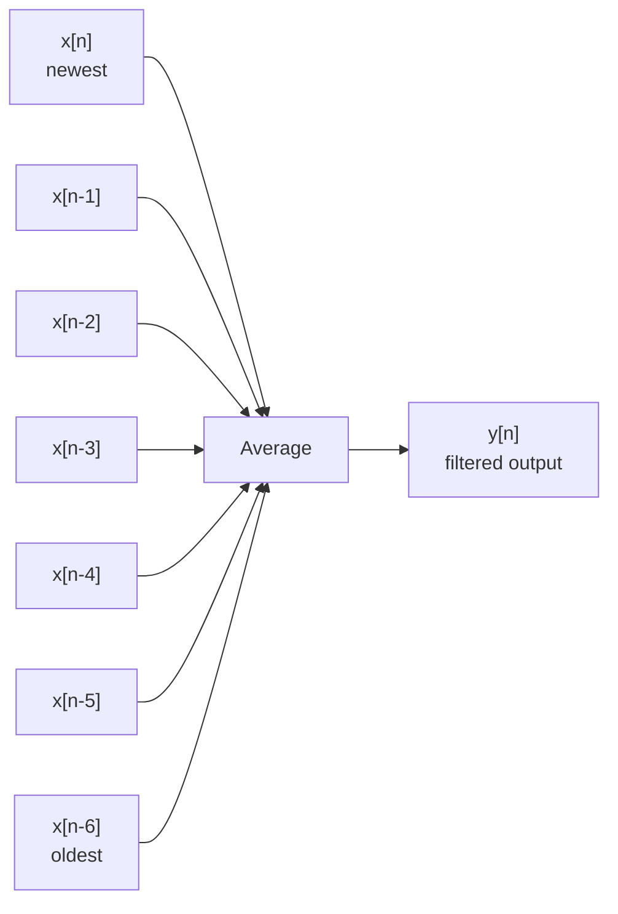

## 42. Worked FIR Example

Assume the actual speed is around 1400 RPM and seven raw samples are:

```text
1390, 1410, 1395, 1408, 1388, 1406, 1403
```

Add them:

```text
1390 + 1410 + 1395 + 1408 + 1388 + 1406 + 1403 = 9800
```

Divide by seven:

```text
9800 / 7 = 1400 RPM
```

The individual samples jump around, but their average is close to the real
speed.

## 43. FIR Code

```js
this.samples.push(this.rawRpm);

if (this.samples.length > 25) {
  this.samples.shift();
}

const taps = Math.min(
  this.config.filterTaps,
  this.samples.length
);

const recent = this.samples.slice(-taps);

const firValue =
  recent.reduce((sum, sample) => sum + sample, 0) / taps;
```

Line-by-line:

1. Add the newest raw sensor value.
2. Keep at most 25 stored samples.
3. Choose the configured number of taps.
4. Select that many recent values.
5. Add them and divide by their count.

Then:

```js
this.filteredRpm = this.config.filterEnabled
  ? firValue
  : this.rawRpm;
```

If filtering is disabled, the app uses the raw value.

## 44. FIR Trade-Off

More taps:

- Reduce more noise.
- Produce a smoother line.
- Introduce more delay.

Fewer taps:

- React faster.
- Provide less smoothing.
- Allow more noise through.

Filtering is always a compromise between smoothness and responsiveness.

## 45. Why Is FIR Called Inherently Stable?

Our FIR output only depends on a finite number of input samples. It does not
feed its own output back into itself.

An IIR filter can include old outputs:

```text
new output = input terms + previous output terms
```

That feedback can become unstable if coefficients are poorly chosen.

An FIR filter has no recursive output feedback, so bounded inputs produce
bounded outputs when coefficients are finite.

---

# Part 8: Stability and Performance

## 46. What Does Stable Mean?

In this project, stable means:

- The motor speed approaches the target.
- It does not grow without limit.
- It does not continue oscillating strongly.
- It stays close to the target after settling.

Stable does not mean the value is mathematically perfect or completely still.
Small noise and small error can remain.

## 47. Typical Step Response

When the target suddenly changes from 0 to 1400 RPM, that target change is a
**step input**.

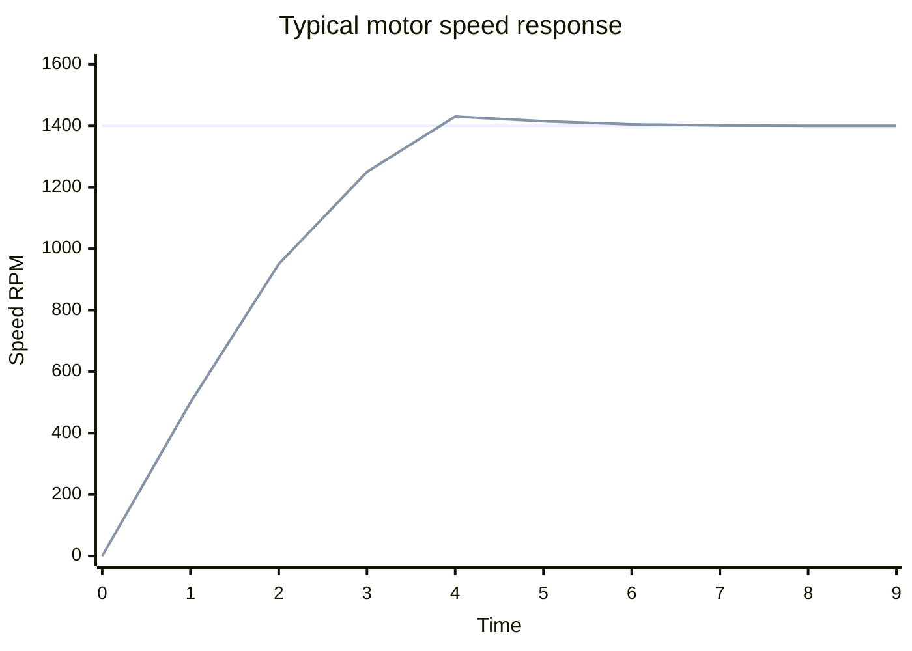

The motor needs time to accelerate because it has inertia.

## 48. Rise Time

Rise time is how long the response takes to move from a low percentage of the
target to a high percentage, often 10% to 90%.

RotorLab does not currently display rise time, but it could be added.

## 49. Overshoot

Overshoot occurs when speed goes above the target.

```text
Overshoot % =
  ((maximum measured speed - target speed) / target speed) x 100
```

Example:

```text
Target = 1400 RPM
Maximum = 1450 RPM

Overshoot = ((1450 - 1400) / 1400) x 100
          = 3.57%
```

Code:

```js
const overshoot = this.config.targetRpm
  ? Math.max(
      0,
      ((this.maxRpm - this.config.targetRpm) /
        this.config.targetRpm) * 100
    )
  : 0;
```

## 50. Steady-State Error

Steady-state error is the error remaining after the system has had enough time
to settle.

Example:

```text
Target = 1400 RPM
Final speed = 1385 RPM
Steady-state error = 15 RPM
```

Integral action is mainly used to remove this remaining error.

## 51. Settling Time

Settling time is how long the system takes to enter and remain inside an
acceptable band around the target.

RotorLab uses a `2%` band.

At 1400 RPM:

```text
2% of 1400 = 28 RPM
```

Therefore the acceptable range is approximately:

```text
1372 RPM to 1428 RPM
```

The code requires 15 consecutive samples inside the band.

Each sample is 0.2 seconds:

```text
15 x 0.2 = 3 seconds
```

So the speed must stay close to the target for about three seconds before the
system records settling.

## 52. Mean Squared Error

MSE means **Mean Squared Error**.

For every sample:

1. Calculate the speed error.
2. Square it.
3. Add it to the total.
4. Divide by the number of samples.

```text
MSE = sum(error²) / number of samples
```

### Example

Errors:

```text
10, -5, 2
```

Squares:

```text
100, 25, 4
```

MSE:

```text
(100 + 25 + 4) / 3 = 43
```

Squaring:

- Removes negative signs.
- Penalizes large errors more strongly.

Lower MSE generally means better tracking.

## 53. RotorLab Status Labels

The server assigns:

- `stopped`: Motor is not running.
- `correcting`: Error is greater than 8%.
- `settling`: Error is within 8% but not yet stably within 2%.
- `stable`: Error is within 2% for consecutive samples.

```js
stability =
  errorPercent <= 2 && this.stableSamples >= 5
    ? "stable"
    : errorPercent <= 8
      ? "settling"
      : "correcting";
```

These are project-defined labels, not a complete mathematical proof of
control-system stability.

---

# Part 9: The Simulated Motor Equation

## 54. Important Honesty

This project is not a full electromagnetic induction motor model.

A high-fidelity model may use:

- Stator voltage equations
- Rotor voltage equations
- Magnetic flux linkages
- Mutual inductance
- Clarke and Park transformations
- d-axis and q-axis models
- Electromagnetic torque equations
- Mechanical shaft equations

RotorLab uses a simpler first-order dynamic approximation. This makes it easier
to understand and suitable for a short software project.

## 55. Load Ratio

```js
const loadRatio =
  (this.config.loadTorqueNm + this.disturbance) /
  this.motor.ratedTorqueNm;
```

If:

```text
Load = 8 Nm
Rated torque = 14.6 Nm

Load ratio = 8 / 14.6
           = approximately 0.548
```

The motor is carrying about 54.8% of rated torque.

## 56. Simulated Speed Loss From Load

```js
const loadLoss = loadRatio * 48;
```

For a load ratio of 0.548:

```text
Load loss = 0.548 x 48
          = approximately 26.3 RPM
```

The number `48` is a chosen simulation scaling constant. It is not a universal
law of induction motors.

## 57. Time Constant

```js
const timeConstant =
  0.85 + this.motor.inertiaKgM2 * 10;
```

For inertia `0.018`:

```text
Time constant = 0.85 + 0.018 x 10
              = 1.03
```

Higher inertia gives a larger time constant and slower speed response.

## 58. Acceleration Approximation

```js
const acceleration =
  (targetFromDrive - this.actualRpm - loadLoss) /
  timeConstant;
```

Meaning:

- If commanded speed is much greater than current speed, accelerate.
- If load increases, acceleration decreases.
- If actual speed approaches commanded speed, acceleration approaches zero.
- A larger time constant slows the response.

The new speed is:

```js
this.actualRpm =
  this.actualRpm + acceleration * dt;
```

This is numerical integration:

```text
new speed = old speed + acceleration x small time interval
```

## 59. What Is `dt`?

`dt` means a small change in time.

RotorLab uses:

```text
dt = 0.2 seconds
```

The server calls:

```js
simulation.step(0.2);
```

every 200 milliseconds:

```js
setInterval(() => {
  io.emit("motor:update", simulation.step(0.2));
}, 200);
```

## 60. Disturbance

A disturbance is an unexpected influence on a control system.

Examples:

- More boxes are placed on a conveyor.
- A pump encounters higher water pressure.
- A fan faces an airflow obstruction.
- An elevator takes on more passengers.

The button calls:

```js
applyDisturbance() {
  this.disturbance = this.motor.ratedTorqueNm * 0.48;
}
```

For the default motor:

```text
Disturbance = 14.6 x 0.48
            = approximately 7.0 Nm
```

The disturbance then decays:

```js
this.disturbance *= 0.88;
```

Each update leaves 88% of the previous disturbance. This creates a temporary
load rather than a permanent one.

---

# Part 10: Complete Software Architecture

## 61. Local Application Architecture

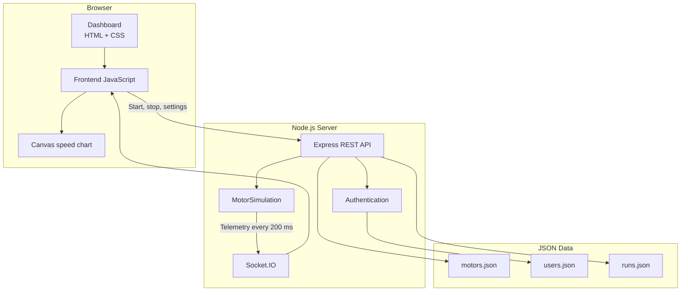

## 62. Hosted Vercel Architecture

Vercel does not keep an ordinary long-running Socket.IO process alive in the
same way as the local Express server.

Therefore, the deployed demonstration uses a browser-side fallback:

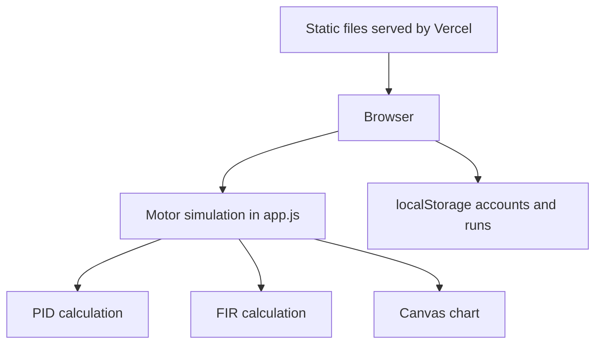

This distinction is important:

| Feature | Local `npm start` | Vercel deployment |
|---|---|---|
| Motor simulation | Node server | Browser |
| Real-time transport | Socket.IO | Direct in-browser updates |
| Accounts | Hashed in JSON | Browser localStorage |
| Saved runs | JSON file | Browser localStorage |
| Express API | Yes | No persistent Express process |

The local version better demonstrates the requested API architecture. The
Vercel version provides an easily accessible visual demonstration.

## 63. Project Files

```text
class-project/
|-- public/
|   |-- index.html
|   |-- styles.css
|   `-- app.js
|-- server/
|   |-- data/
|   |   |-- motors.json
|   |   |-- users.json
|   |   `-- runs.json
|   `-- motor-simulation.js
|-- test/
|   `-- motor-simulation.test.js
|-- server.js
|-- package.json
|-- vercel.json
|-- README.md
|-- REPORT.md
`-- STUDY_GUIDE.md
```

---

# Part 11: Backend Walkthrough

## 64. `server.js`

This is the local application entry point.

It performs five major jobs:

1. Starts Express.
2. Serves frontend files.
3. Provides API endpoints.
4. Handles authentication and JSON storage.
5. Broadcasts simulation data with Socket.IO.

## 65. Important Imports

```js
const express = require("express");
const http = require("http");
const path = require("path");
const fs = require("fs");
const crypto = require("crypto");
const { Server } = require("socket.io");
const { MotorSimulation } =
  require("./server/motor-simulation");
```

| Import | Purpose |
|---|---|
| `express` | HTTP API and static files |
| `http` | Underlying web server |
| `path` | Safe file paths |
| `fs` | Read and write JSON |
| `crypto` | Password hashing, salts, IDs, tokens |
| `socket.io` | Real-time server-to-browser updates |
| `MotorSimulation` | Motor/PID/FIR logic |

## 66. Loading Local JSON

```js
const motors = readJson("motors.json");
let users = readJson("users.json");
let runs = readJson("runs.json");
```

The JSON files act as a small local database.

## 67. REST API

REST endpoints let the browser send commands.

| Method | Endpoint | Action |
|---|---|---|
| `GET` | `/api/motors` | Return motor definitions |
| `POST` | `/api/auth/register` | Create an account |
| `POST` | `/api/auth/login` | Log in |
| `GET` | `/api/simulation/status` | Read current state |
| `POST` | `/api/simulation/start` | Start motor |
| `POST` | `/api/simulation/stop` | Stop motor |
| `POST` | `/api/simulation/reset` | Reset experiment |
| `POST` | `/api/simulation/disturbance` | Add temporary load |
| `PATCH` | `/api/simulation/control` | Change target, load, PID, FIR |
| `GET` | `/api/performance` | Read saved runs |
| `POST` | `/api/performance` | Save current run |

### Why Different HTTP Methods?

- `GET`: Read information.
- `POST`: Create something or trigger an action.
- `PATCH`: Partially update existing settings.

## 68. Authentication Flow

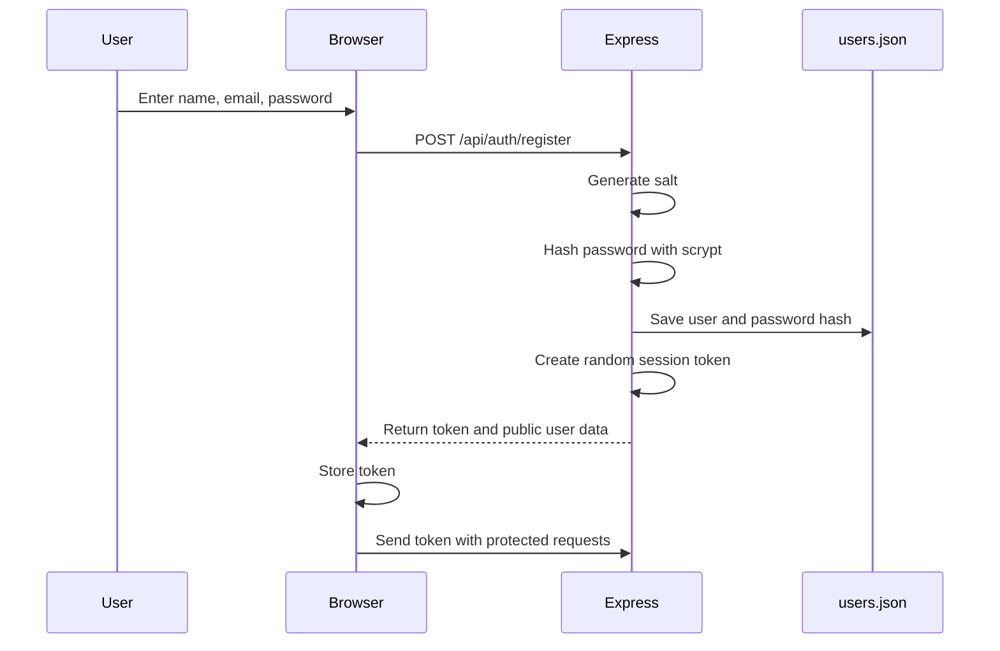

## 69. Salted Password Hashing

The local server does not store the original password.

It creates a random salt:

```js
const salt = crypto.randomBytes(16).toString("hex");
```

It hashes the password:

```js
crypto.scryptSync(password, salt, 64).toString("hex");
```

A salt makes identical passwords produce different hashes for different users.

### Important Limitation

The hosted Vercel demo stores demo account information in browser localStorage.
That is convenient for a classroom demonstration but is not production-grade
authentication.

Do not claim that the hosted version is secure cloud authentication.

## 70. Session Tokens

After login, the server creates a random token:

```js
const token = crypto.randomBytes(24).toString("hex");
```

The browser sends:

```text
Authorization: Bearer <token>
```

The `requireAuth` middleware checks the token before allowing control commands
or access to saved runs.

## 71. Socket.IO

HTTP requests are useful when the user clicks a button. They are less convenient
for continuously pushing data five times per second.

Socket.IO creates a persistent real-time connection.

Server:

```js
setInterval(() => {
  io.emit("motor:update", simulation.step(0.2));
}, 200);
```

Browser:

```js
socket?.on("motor:update", (snapshot) => {
  latest = snapshot;
  history.push(snapshot);
  render(snapshot);
  drawChart();
});
```

The server calculates a new snapshot and broadcasts it. The browser receives it,
updates text, and redraws the graph.

---

# Part 12: `MotorSimulation` Walkthrough

## 72. Configuration

```js
const DEFAULT_CONFIG = {
  targetRpm: 1400,
  loadTorqueNm: 8,
  kp: 0.72,
  ki: 0.18,
  kd: 0.06,
  filterEnabled: true,
  filterTaps: 7,
};
```

These are the initial experiment settings.

## 73. State Variables

| Variable | Meaning |
|---|---|
| `running` | Whether drive is enabled |
| `actualRpm` | Ideal hidden motor speed |
| `rawRpm` | Noisy sensor measurement |
| `filteredRpm` | FIR-filtered measurement |
| `integral` | Accumulated PID error |
| `previousError` | Last error for derivative |
| `samples` | Recent sensor readings |
| `elapsedSeconds` | Simulation time |
| `maxRpm` | Highest measured speed |
| `squaredErrorSum` | Total used for MSE |
| `sampleCount` | Number of samples |
| `stableSamples` | Consecutive samples near target |
| `settlingTimeSeconds` | Recorded settling time |
| `disturbance` | Temporary extra load |

## 74. One Complete `step()`

Every 0.2 seconds:

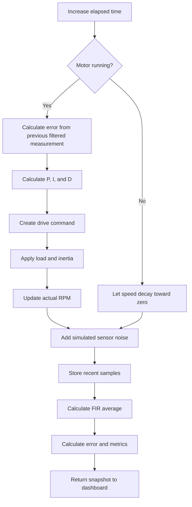

## 75. Snapshot

A snapshot is the complete state sent to the frontend:

```js
{
  running,
  motor,
  config,
  rawRpm,
  filteredRpm,
  actualRpm,
  synchronousSpeed,
  slipPercent,
  speedError,
  overshootPercent,
  settlingTimeSeconds,
  meanSquaredError,
  stability,
  elapsedSeconds
}
```

This is similar to serializing application state for a frontend.

---

# Part 13: Frontend Walkthrough

## 76. `public/index.html`

This defines:

- Login/register screen
- Main navigation
- Live RPM values
- Control sliders
- PID inputs
- FIR toggle
- Speed chart canvas
- Motor parameters
- Stability analysis
- Saved experiments
- Application examples

HTML gives the interface its structure.

## 77. `public/styles.css`

This controls:

- Dark industrial appearance
- Amber highlight color
- Responsive desktop/mobile layouts
- Typography
- Buttons and inputs
- Status indicators
- Authentication layout

It does not perform motor calculations.

## 78. `public/app.js`

This connects the interface to the simulation.

Major responsibilities:

- Authentication form handling
- Start, stop, and reset button handling
- Control input updates
- Receiving Socket.IO data locally
- Running browser simulation on Vercel
- Updating dashboard values
- Drawing the graph
- Saving and displaying experiment history

## 79. `render(data)`

This function copies snapshot values into HTML:

```js
$("filteredRpm").textContent =
  Math.round(data.filteredRpm).toLocaleString();
```

The helper:

```js
const $ = (id) => document.getElementById(id);
```

means:

```js
$("filteredRpm")
```

is a shorter version of:

```js
document.getElementById("filteredRpm")
```

## 80. Canvas Chart

The graph is drawn manually with the Canvas API.

Three lines are plotted:

- Raw RPM
- Filtered RPM
- Target RPM

Each sample's horizontal position represents time. Its vertical position
represents speed.

```js
const x =
  index / (history.length - 1) * width;

const y =
  height - value / maxRpm * height;
```

Canvas coordinates start at the top-left, so larger RPM values must be converted
to smaller vertical pixel coordinates. That is why the expression subtracts
from `height`.

## 81. Why Keep 180 Samples?

```js
if (history.length > 180) history.shift();
```

The system generates five samples per second:

```text
180 / 5 = 36 seconds
```

Therefore the chart displays approximately the latest 36 seconds.

## 82. Debounced Control Updates

Sliders can fire many events while being dragged.

```js
clearTimeout(controlTimer);
controlTimer = setTimeout(() => {
  // send control values
}, 120);
```

This waits briefly before sending the latest values. It reduces unnecessary
requests. This technique is called **debouncing**.

---

# Part 14: Tests

## 83. Why Test the Simulation?

Tests protect core assumptions.

The project currently tests:

1. Synchronous speed calculation.
2. Motor acceleration.
3. FIR output generation.

Run:

```powershell
npm test
```

## 84. Synchronous Speed Test

```js
assert.equal(simulation.synchronousSpeed, 1500);
```

For 50 Hz and four poles, the formula must return 1500 RPM.

## 85. Acceleration Test

The test starts the motor, runs many simulation steps, and checks that speed:

- Becomes greater than 1000 RPM.
- Does not exceed the allowed maximum.

## 86. FIR Test

The test inserts sample values, performs a step, and confirms that:

- The output is a finite number.
- Filtered output is different from the raw noisy measurement.

---

# Part 15: How to Demonstrate the Project

## 87. Five-Minute Demonstration Script

### Opening

> Our project is RotorLab, a web-based induction motor speed control and
> monitoring simulator. It demonstrates a closed-loop motor controller without
> requiring dangerous high-voltage hardware.

### Motor Parameters

> The selected motor is a 2.2 kilowatt, 415 volt, 50 hertz, four-pole,
> three-phase induction motor. Its synchronous speed is calculated as 120 times
> frequency divided by poles, which gives 1500 RPM.

### Explain Slip

> The rotor must operate below synchronous speed for induction and torque to
> occur. At 1400 RPM, its slip is about 6.67 percent.

### Start the Motor

> I will set the target to 1400 RPM and start the motor. The PID controller
> repeatedly compares the target with the measured speed and changes the
> simulated drive command.

### Explain the Chart

> The rough line is the raw sensor signal containing simulated electrical and
> measurement noise. The smoother line is the seven-tap FIR moving average. The
> dashed line is the target speed.

### Apply Disturbance

> This button represents a sudden increase in mechanical load, such as adding
> boxes to a conveyor. Speed falls temporarily, error increases, and the PID
> controller applies more effort to restore the target.

### Stability Page

> We assess performance using speed error, overshoot, settling time, and mean
> squared error. The system is marked stable after remaining within two percent
> of target for consecutive samples.

### Architecture

> Locally, Express provides the API, Socket.IO sends telemetry every 200
> milliseconds, and JSON files store users, motor definitions, and experiment
> results. The Vercel version uses an in-browser simulation because Vercel does
> not host a persistent Socket.IO loop in this deployment.

### Closing

> This approach can be extended to a physical motor using an encoder or
> Hall-effect RPM sensor, a real VFD, and a microcontroller or industrial PLC.

## 88. What to Click During the Demo

1. Create an account.
2. Show the displayed motor parameters.
3. Set target to 1400 RPM.
4. Start the motor.
5. Wait for speed to approach the target.
6. Toggle FIR off and on to compare noise.
7. Apply a load disturbance.
8. Show recovery.
9. Open Analysis.
10. Explain overshoot, settling time, and MSE.
11. Save the run.
12. Open Applications.

## 89. Safe PID Experiments

Use the defaults for the main demo:

```text
Kp = 0.72
Ki = 0.18
Kd = 0.06
```

To discuss behavior:

- Reduce `Ki` toward zero: More remaining steady-state error may appear.
- Increase `Kp`: Response becomes more aggressive.
- Increase gains too far: The response may become less smooth.
- Increase load: Controller needs more effort and recovery time.

Reset after experiments before the final demonstration.

---

# Part 16: Likely Defense Questions

## 90. Basic Questions

### What is an induction motor?

An induction motor is an AC motor in which the stator's rotating magnetic field
induces current in the rotor, producing torque.

### Why use an induction motor?

It is robust, affordable, reliable, efficient, and widely used in industry.

### What is RPM?

RPM means revolutions per minute and measures rotational speed.

### What is synchronous speed?

It is the speed of the stator's rotating magnetic field:

```text
Ns = 120f / P
```

### What is slip?

Slip is the percentage difference between synchronous speed and rotor speed:

```text
Slip = ((Ns - Nr) / Ns) x 100%
```

### Why is slip necessary?

Relative motion between the stator field and rotor is needed to induce rotor
current and produce torque.

## 91. Control Questions

### What is closed-loop control?

It measures output, compares it with the target, and feeds the error back to a
controller for correction.

### What is a PID controller?

It combines proportional reaction to current error, integral reaction to
accumulated error, and derivative reaction to the rate of error change.

### Why use integral control?

It removes persistent steady-state error.

### Why use derivative control?

It can reduce overshoot and rapid oscillation by reacting to how quickly error
changes.

### What is PID tuning?

It is selecting `Kp`, `Ki`, and `Kd` values that provide a suitable balance of
speed, overshoot, stability, and noise sensitivity.

### What is integral windup?

It is excessive accumulated error when the actuator cannot meet the command.
The project limits the integral value to reduce windup.

## 92. Filter Questions

### What is noise?

Noise is unwanted variation in a measured signal caused by interference,
vibration, resolution, or other measurement imperfections.

### What is an FIR filter?

It is a digital filter whose output depends on a finite number of present and
past input samples.

### What FIR filter did you use?

A seven-tap equal-coefficient moving average.

### Why seven taps?

It gives visible smoothing while retaining a reasonably quick response. It is
an engineering demonstration choice, not a universal optimum.

### What is the disadvantage of more taps?

More smoothing but more delay.

### Why is FIR stable?

It has no recursive output feedback and uses finite coefficients and finite
input history.

## 93. Software Questions

### Why Express?

Express provides a simple REST API, static-file hosting, authentication routes,
and access to local JSON storage.

### Why Socket.IO?

It pushes new telemetry to the dashboard every 200 milliseconds without the
browser repeatedly making HTTP requests.

### Why JSON instead of MongoDB or Supabase?

The brief explicitly suggested a simple local JSON API. JSON also ensures that
the demonstration works without internet access. A production version could
replace JSON with MongoDB Atlas or Supabase while retaining the same API.

### Is the application actually controlling a physical motor?

No. It is an educational software simulation. A physical implementation would
need a motor, VFD, speed sensor, isolation, protection equipment, and a
microcontroller, PLC, or industrial communication interface.

### Is the simulation a complete motor model?

No. It is a simplified first-order dynamic model intended to demonstrate PID
control, load response, sensor noise, FIR filtering, and monitoring.

### Why is Vercel different from the local version?

The local version runs a persistent Express and Socket.IO process. The deployed
Vercel version runs the simulation in the browser because this Vercel setup is
static and does not maintain the long-running socket process.

## 94. Harder Questions

### How would you connect a physical motor?

1. Attach an encoder or Hall sensor to the shaft.
2. Read pulses with a microcontroller or PLC.
3. Calculate RPM.
4. Filter the measured RPM.
5. Run PID control.
6. Send a safe speed reference to a real VFD.
7. Add isolation, emergency stop, overload, and overspeed protection.
8. Send telemetry to the web server through Wi-Fi, Ethernet, or serial
   communication.

### Can a web browser directly drive a 415 V motor?

No. That would be dangerous. The browser should only send a command to a
protected control layer. A VFD, PLC, microcontroller, relays, and electrical
protection must handle physical equipment.

### What could improve the model?

- Electrical current and voltage equations
- Electromagnetic torque model
- Thermal model
- Variable frequency calculation
- Voltage/frequency control
- Current limiting
- Better friction and load models
- Real sensor data
- Automatic PID tuning
- MongoDB or Supabase persistence

---

# Part 17: Applications

## 95. Conveyor Belt

Problem:

- Adding products increases load.
- Speed may fall.
- Production timing becomes inconsistent.

Solution:

- Sensor measures belt/motor speed.
- PID controller increases drive effort.
- Speed returns to the setpoint.

## 96. Water Pump

Problem:

- Required water flow changes.
- Running at full speed wastes energy.

Solution:

- VFD changes motor speed based on pressure or flow demand.
- Lower demand allows lower speed and reduced power consumption.

## 97. HVAC Fan

Problem:

- Airflow demand changes with room occupancy and temperature.

Solution:

- Variable-speed motor control matches airflow to demand.
- This reduces energy use, noise, and mechanical stress.

## 98. Elevator

Motor control provides:

- Smooth acceleration
- Constant travel speed
- Smooth deceleration
- Load compensation
- Accurate stopping

Real elevator control requires much more safety engineering than this project.

## 99. Machine Tools

Lathes, mills, and other machines need controlled spindle speed. Poor speed
control can reduce manufacturing quality.

---

# Part 18: Four-Person Team Study Plan

## 100. Suggested Division

### Person 1: Motor Fundamentals

Learn:

- AC and three-phase supply
- Stator and rotor
- Torque and load
- Frequency and poles
- Synchronous speed
- Slip
- Applications

Must be able to calculate:

```text
Ns = 120 x 50 / 4 = 1500 RPM
Slip at 1400 RPM = 6.67%
```

### Person 2: PID and Stability

Learn:

- Setpoint
- Feedback
- Error
- P, I, and D
- Tuning
- Overshoot
- Settling time
- Steady-state error
- MSE

### Person 3: Sensor and FIR

Learn:

- RPM sensors
- Noise sources
- Raw versus actual versus filtered RPM
- FIR meaning
- Moving average
- Tap count
- Smoothing versus delay

Must be able to average seven example values.

### Person 4: Software Architecture

Learn:

- Express
- REST endpoints
- Socket.IO
- JSON files
- Authentication
- Canvas chart
- Local versus Vercel architecture
- Tests and project limitations

## 101. What Everyone Must Know

Every member should be able to answer:

1. What problem does the project solve?
2. What is an induction motor?
3. What is the 1500 RPM calculation?
4. What is slip?
5. What does PID do?
6. What does FIR do?
7. What happens after a load disturbance?
8. Is the motor physical or simulated?
9. Why use Express and Socket.IO?
10. What are the project's limitations?

---

# Part 19: Rapid Revision Sheet

## 102. Ten Sentences to Remember

1. An induction motor converts three-phase AC electrical energy into rotating
   mechanical motion.
2. Its stationary stator creates a rotating magnetic field, which induces
   current and torque in the rotor.
3. Synchronous speed is `120 x frequency / poles`.
4. A 50 Hz, four-pole motor has a synchronous speed of 1500 RPM.
5. The rotor runs below synchronous speed, and the percentage difference is
   called slip.
6. A VFD controls motor speed by varying the supplied frequency and voltage.
7. A PID controller compares target speed with measured speed and adjusts the
   drive command.
8. Sensor noise makes raw RPM fluctuate even when actual speed is nearly steady.
9. A seven-tap FIR moving average smooths recent RPM measurements.
10. RotorLab is a simplified educational simulation, not a physical motor or a
    complete electromagnetic model.

## 103. Essential Formulas

```text
Synchronous speed:
Ns = 120f / P

Slip:
s = ((Ns - Nr) / Ns) x 100%

Speed error:
e = target - measured

PID:
u = Kp e + Ki integral(e) + Kd de/dt

Moving-average FIR:
y[n] = (x[n] + x[n-1] + ... + x[n-6]) / 7

Overshoot:
((maximum speed - target) / target) x 100%

Mean squared error:
MSE = sum(error²) / number of samples

Mechanical power:
P = T x omega

Angular speed:
omega = 2 x pi x RPM / 60
```

## 104. Essential Default Values

```text
Power:       2.2 kW
Voltage:     415 V
Frequency:   50 Hz
Poles:       4
Rated speed: 1440 RPM
Target:      1400 RPM
Sync speed:  1500 RPM
Rated torque: 14.6 Nm
Load:        8 Nm
Kp:          0.72
Ki:          0.18
Kd:          0.06
FIR taps:    7
Update rate: 0.2 seconds
```

---

# Part 20: Practice Quiz

Try answering before reading the answers.

## 105. Questions

1. What energy conversion occurs in an electric motor?
2. What are the stator and rotor?
3. Why is the motor called an induction motor?
4. What does RPM mean?
5. Calculate synchronous speed for 50 Hz and four poles.
6. Why does the rotor run below synchronous speed?
7. Calculate slip at 1440 RPM when synchronous speed is 1500 RPM.
8. What does a VFD control?
9. What is a setpoint?
10. What is speed error?
11. What does the proportional PID term use?
12. Why is the integral term useful?
13. What does the derivative term observe?
14. What is integral windup?
15. What is sensor noise?
16. What does FIR mean?
17. What is a filter tap?
18. What happens when FIR tap count increases?
19. What is overshoot?
20. What is settling time?
21. What does MSE measure?
22. What happens when load torque suddenly increases?
23. Why does RotorLab use Socket.IO locally?
24. Where are local motor records stored?
25. Is RotorLab a complete physical induction motor model?

## 106. Answers

1. Electrical energy is converted into mechanical rotation.
2. The stator is stationary; the rotor turns.
3. The stator field induces current in the rotor.
4. Revolutions per minute.
5. `120 x 50 / 4 = 1500 RPM`.
6. Relative speed is required for induction and torque production.
7. `((1500 - 1440) / 1500) x 100 = 4%`.
8. The effective frequency and voltage supplied to the motor.
9. The desired target value.
10. Target speed minus measured speed.
11. Current error.
12. It removes persistent steady-state error.
13. How quickly error is changing.
14. Excessive accumulation of integral error.
15. Unwanted variation in a measurement.
16. Finite Impulse Response.
17. One recent sample and its filter coefficient.
18. Smoothing increases, but delay also increases.
19. How far the response goes above the target.
20. Time required to enter and remain inside an acceptable target band.
21. Average squared tracking error.
22. Speed tends to fall, error increases, and PID increases effort.
23. To push telemetry to the browser every 200 milliseconds.
24. JSON files under `server/data`.
25. No. It is a simplified educational dynamic simulation.

---

# Final Mental Model

When you feel lost, return to this:

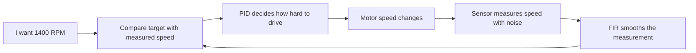

The motor section explains **what is rotating**.

The PID section explains **how we correct its speed**.

The FIR section explains **how we clean the measurement**.

The stability section explains **how we judge performance**.

The Express and Socket.IO section explains **how the calculations reach the web
dashboard in real time**.

That is RotorLab.
